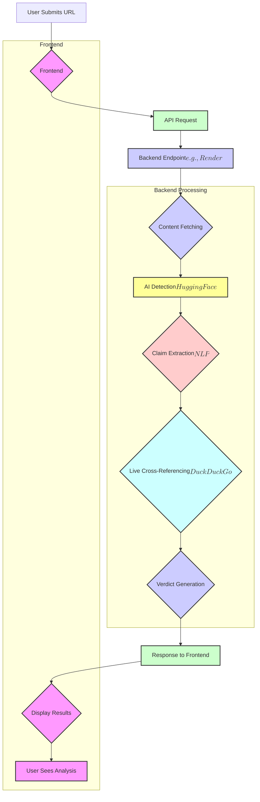

## How It Works

This section illustrates a process using a Mermaid diagram.

```mermaid
graph TD
    %% Define styles
    classDef frontend fill:#f9f,stroke:#333,stroke-width:2px;
    classDef backend fill:#ccf,stroke:#333,stroke-width:2px;
    classDef api fill:#cfc,stroke:#333,stroke-width:2px;
    classDef ai fill:#ff9,stroke:#333,stroke-width:2px;
    classDef nlp fill:#fcc,stroke:#333,stroke-width:2px;
    classDef crossref fill:#cff,stroke:#333,stroke-width:2px;

    %% Nodes
    A[User Submits URL] --> B{Frontend};
    B --> C[API Request];
    C --> D[Backend Endpoint $$e.g., Render$$];
    D --> E{Content Fetching};
    E --> F[AI Detection $$Hugging Face$$];
    F --> G{Claim Extraction $$NLP$$};
    G --> H{Live Cross-Referencing $$DuckDuckGo$$};
    H --> I{Verdict Generation};
    I --> J[Response to Frontend];
    J --> K{Display Results};
    K --> L[User Sees Analysis];

    %% Apply styles to nodes
    class B frontend;
    class C api;
    class D backend;
    class E backend;
    class F ai;
    class G nlp;
    class H crossref;
    class I backend;
    class J api;
    class K frontend;
    class L frontend;

    %% Subgraphs
    subgraph Backend Processing
        E
        F
        G
        H
        I
    end

    subgraph Frontend
        B
        K
        L
    end
```
